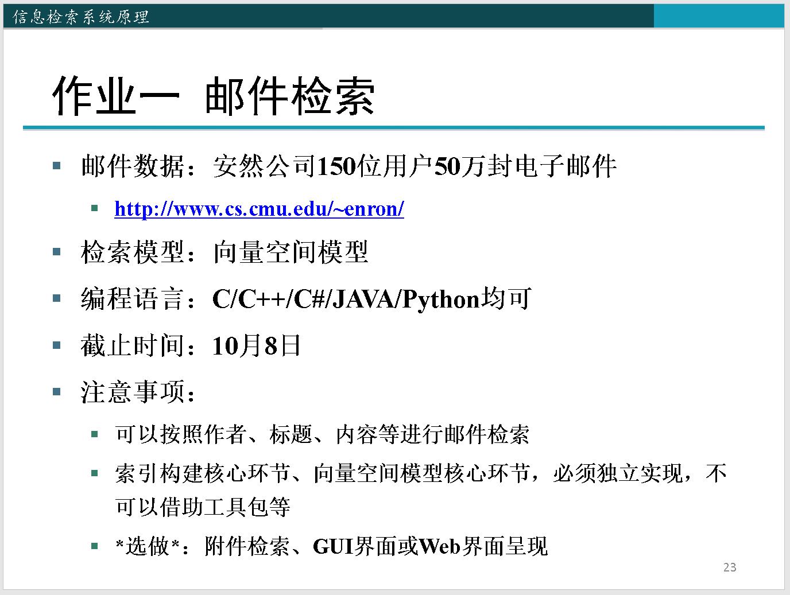
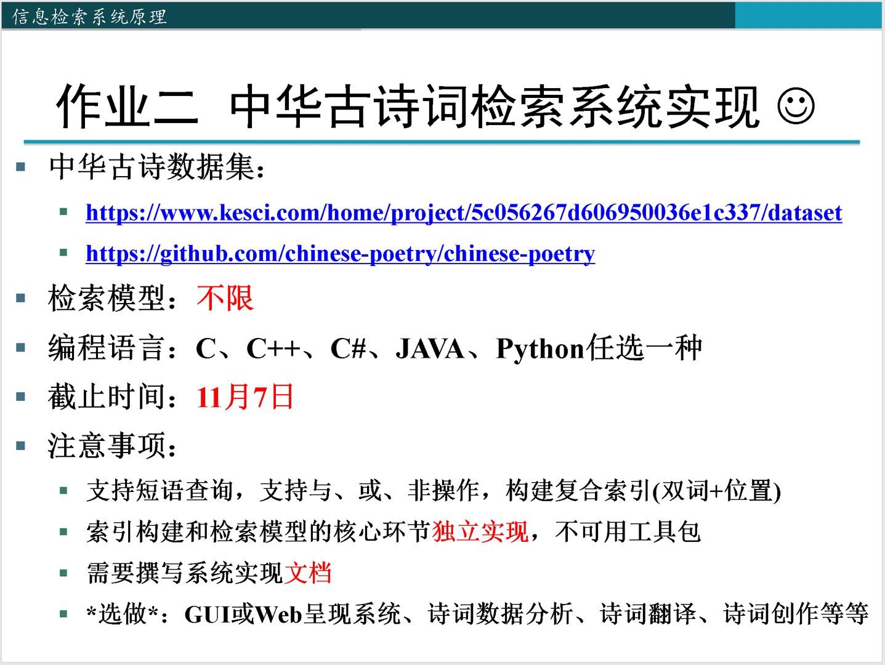
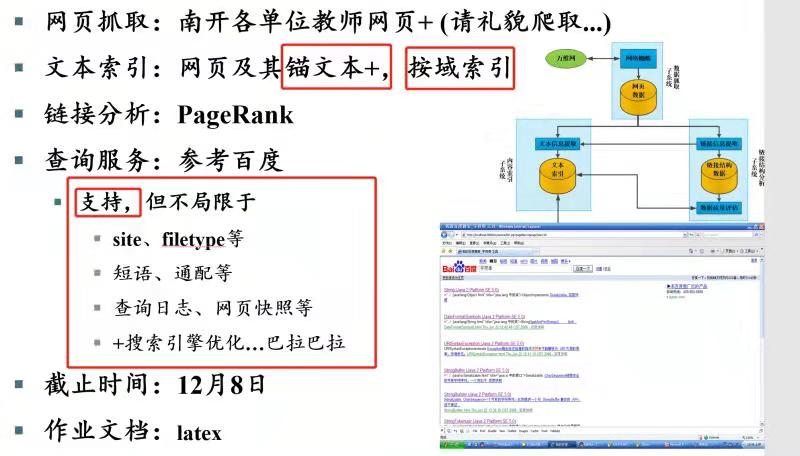

# Information-retrieval-2019
> 信息检索系统学习作业项目
> 最新修改于2019.11.8 @[jack-lio](https://github.com/Jack-Lio)

------------------------

## 1 enron 公司电子邮件检索系统

- 项目说明
>项目内容：本系统基于向量空间模型实现对enron公司150位用户50万封电子邮件进行检索
>检索模型：向量空间模型
>编程语言：Python     
>工具包：nltk、flask、elementUI ...
>数据来源：[eron 电子邮件数据集](http://www.cs.cmu.edu/~enron/)
>实现功能：基于发件时间、发件人、收件人、主题、正文对邮件进行检索，同时拓展了功能实现语音检索功能，对系统进行整合优化，建立前端UI界面对系统进行友好调用。
[系统设计说明文档](./pro1/enron 公司电子邮件检索系统.md)

-------------------------

## 2 中华诗词检索系统——Poetry Google
> 系统实现功能：实现一个支持短语查询、与或非查询的系统，需要构建复合索引（双词+位置），能够对诗文进行基本的检索功能。在此基础上本系统添加了对与不同域的查询功能，能够支持对作者，标题和正文的分类检索。

> ***系统启动与文件说明***: 系统构建不同功能实现模块在不同的文件中，`data_import_process`文件实现了对与繁体中文的简体化功能，以及对于一些索引和诗文数据的导入函数，`index_build`文件中编写了各种难索引的构建函数，按照参数可以构建相应的索引文件，存储路径已经预先规定，`query_op`文件编写了对于查询的相关操作实现，包括基于作者，标题，正文的查询，并实现了对于短语和与或非的查询支持，以及将编号序列转为诗文数据的转换函数，`backend`文件实现了后端的响应支持，`index.html`文件编写了前端的HTML实现。`create`文件下存储了生成的各种索引文件以及转换为简体中文之后的诗文数据文件。在建立好索引文件之后，运行backend文件程序，然后打开index.html文件（注意要联网），之后即可进行系统的使用了。
[系统设计文档](./pro2/中华诗词检索系统报告.md)

-------------------------

## 3 南开教师信息检索系统——web搜索引擎系统

>  ***详情参考相关目录下的实验文档***

-------------------------------

## 4 智能对话咨询系统——知识文本范围为南开大学相关内容
***最终实现的对话咨询系统参考 [微信聊天机器人——基于南开大学相关自建知识库](https://github.com/Jack-Lio/wxchatbot)***
